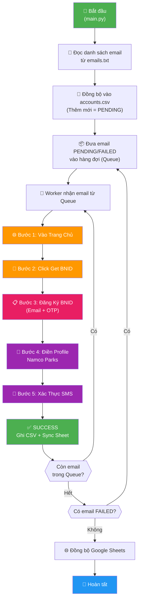
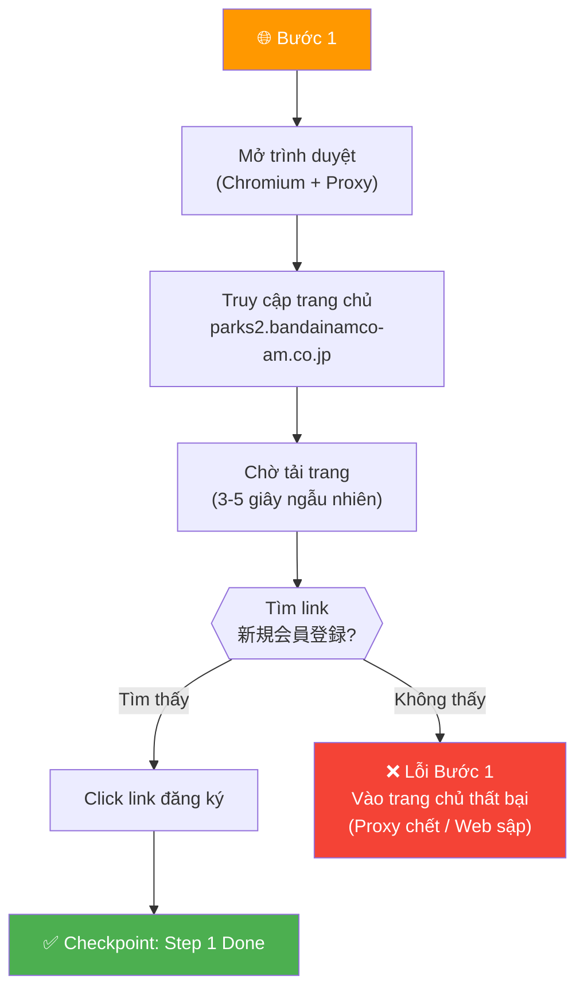
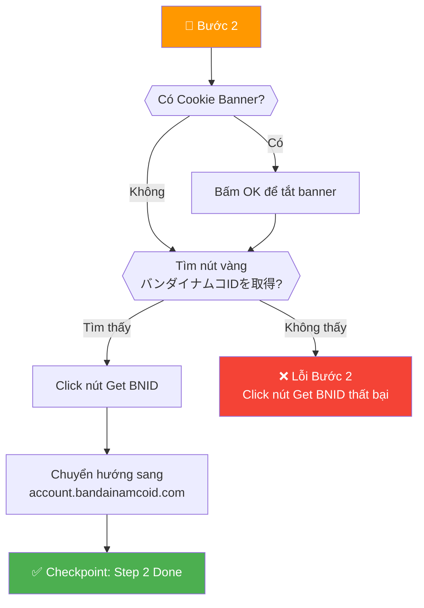
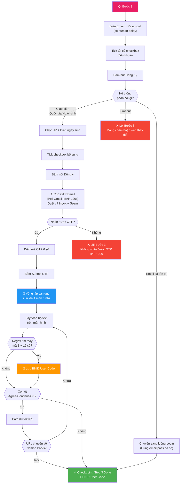
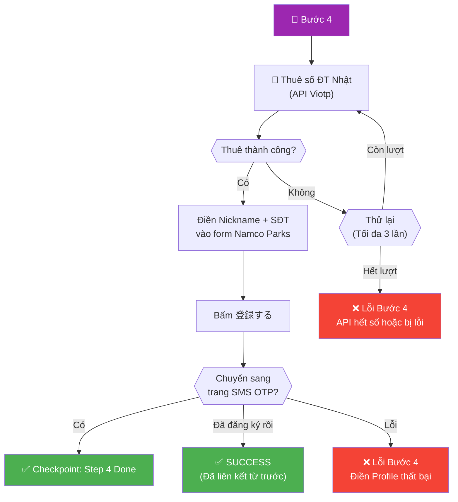
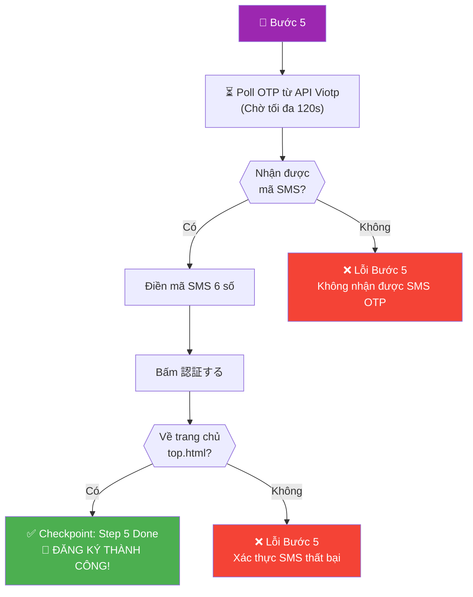

# 🎮 Sơ Đồ Luồng Đăng Ký Namco Parks Auto Bot

## Tổng Quan Luồng Chính



---

## Bước 1: Vào Trang Chủ Namco Parks



---

## Bước 2: Click Nút Get BNID



---

## Bước 3: Đăng Ký BNID + OTP Email (Quan trọng nhất)



---

## Bước 4: Điền Profile Namco Parks + Thuê Số Điện Thoại



---

## Bước 5: Xác Thực SMS OTP



---

## Bảng Tóm Tắt Các Loại Lỗi

| Bước | Mã Lỗi | Nguyên Nhân | Khách Tự Khắc Phục |
|------|---------|-------------|---------------------|
| 1 | `Lỗi Bước 1 (Vào trang chủ)` | Proxy chết / Web sập / Mạng yếu | Đổi proxy hoặc kiểm tra mạng |
| 2 | `Lỗi Bước 2 (Click nút Get BNID)` | Web thay đổi giao diện | Liên hệ hỗ trợ |
| 3 | `Lỗi Bước 3 (OTP Email)` | Bandai không gửi OTP / Gmail chặn | Kiểm tra hòm thư Spam |
| 3 | `Lỗi Bước 3 (Tạo BNID): Email đã được sử dụng` | Email đã đăng ký trước đó | Dùng email khác |
| 4 | `Lỗi Bước 4 (Thuê số SMS)` | API Viotp hết số hoặc hết tiền | Nạp tiền API hoặc chờ |
| 4 | `Lỗi Bước 4 (Điền Profile)` | Web timeout / Proxy lag | Đổi proxy, chạy lại |
| 5 | `Lỗi Bước 5 (Xác thực SMS)` | Số ảo không nhận được SMS | Chạy lại để đổi số mới |

---

## Cấu Trúc Thư Mục Giao Cho Khách

```
📦 Namco_Bot_v1.0/
┣ 📜 RUN_BOT.bat          ← Khách click đúp để chạy
┣ 📜 .env                 ← Cấu hình API key, webhook
┣ 📂 data/
┃ ┣ 📜 emails.txt         ← Khách bỏ email vào đây
┃ ┣ 📜 proxies.txt        ← Khách bỏ proxy vào đây
┃ ┣ 📜 accounts.csv       ← Kết quả xuất ra đây
┃ ┗ 📜 run.log            ← Log chi tiết để debug
┣ 📂 src/                 ← Mã nguồn (đóng gói thì ẩn)
┗ 📂 .venv/               ← Môi trường Python
```
