# 📖 Tài Liệu Kỹ Thuật — Namco Parks Auto Register Bot

> **Mục đích**: Khi tool bị lỗi → mở tài liệu này → tra bảng lỗi → biết ngay **file nào, dòng nào, sửa cái gì**.

---

## 1. Bản Đồ Kiến Trúc Dự Án

```mermaid
flowchart TD
    MAIN["main.py<br/>🎯 Điều phối chính"] --> WORKER["src/worker.py<br/>👷 Quản lý luồng chạy 5 bước"]
    
    WORKER --> S1["src/flows/step1_connect.py<br/>🌐 Bước 1: Vào trang chủ"]
    WORKER --> S2["src/flows/step2_bnid_click.py<br/>🔗 Bước 2: Click Get BNID"]
    WORKER --> S3["src/flows/step3_bnid_register.py<br/>📋 Bước 3: Đăng ký BNID + OTP Email"]
    WORKER --> S4["src/flows/step4_parks_profile.py<br/>📝 Bước 4: Điền Profile + Thuê SĐT"]
    WORKER --> S5["src/flows/step5_sms_verification.py<br/>📱 Bước 5: Xác thực SMS OTP"]
    
    WORKER --> BROWSER["src/core/browser.py<br/>🖥️ Quản lý trình duyệt Chromium"]
    WORKER --> EMAIL["src/core/email_reader.py<br/>📧 Đọc OTP từ Gmail IMAP"]
    WORKER --> SMS["src/core/sms_service.py<br/>📱 API thuê số + nhận SMS"]
    
    MAIN --> CSV["src/utils/csv_writer.py<br/>📝 Ghi kết quả CSV"]
    MAIN --> PROXY["src/utils/proxy_pool.py<br/>🔄 Quản lý danh sách proxy"]
    MAIN --> CONFIG["src/config.py<br/>⚙️ Đọc cấu hình .env + config.json"]
    WORKER --> CHECKPOINT["src/utils/checkpoint.py<br/>💾 Lưu/Load tiến trình"]
    WORKER --> DATAGEN["src/utils/data_gen.py<br/>🎲 Sinh nickname, ngày sinh ngẫu nhiên"]

    style MAIN fill:#4CAF50,color:#fff
    style WORKER fill:#2196F3,color:#fff
    style S1 fill:#FF9800,color:#fff
    style S2 fill:#FF9800,color:#fff
    style S3 fill:#E91E63,color:#fff
    style S4 fill:#9C27B0,color:#fff
    style S5 fill:#9C27B0,color:#fff
```



---

## 2. Chi Tiết Từng Bước

---

### Bước 1 — Vào Trang Chủ Namco Parks

| Thuộc tính | Giá trị |
|---|---|
| **File** | [step1_connect.py](file:///Users/hoangkien/NLV/signup-bandainamco-parks/src/flows/step1_connect.py) |
| **URL truy cập** | `https://parks2.bandainamco-am.co.jp/` |
| **Nhiệm vụ** | Mở trang chủ → Tìm và click link `新規会員登録` (Đăng ký thành viên mới) |

**Selector đang dùng:**
```python
# Tìm link đăng ký trên trang chủ
"a:has-text('新規会員登録'), a[href*='bandainamco_id_connect.html']"
```

**Các lỗi có thể xảy ra:**

| Thông báo lỗi | Nguyên nhân | Cách sửa |
|---|---|---|
| `Lỗi Bước 1 (Vào trang chủ): Timeout` | Proxy chết, mạng yếu, hoặc web Namco sập | Đổi proxy trong `data/proxies.txt` hoặc tắt proxy (`USE_PROXY=false` trong `.env`) |
| `waiting for locator("a:has-text...")` | Web Namco đổi giao diện, link đăng ký bị đổi tên | Mở web bằng tay → Inspect → Tìm link mới → Sửa selector ở **dòng 28** trong file `step1_connect.py` |

---

### Bước 2 — Click Nút "Get BNID"

| Thuộc tính | Giá trị |
|---|---|
| **File** | [step2_bnid_click.py](file:///Users/hoangkien/NLV/signup-bandainamco-parks/src/flows/step2_bnid_click.py) |
| **URL** | `https://parks2.bandainamco-am.co.jp/ext/bandainamco_id_connect.html` |
| **Nhiệm vụ** | Xử lý cookie banner → Click nút vàng `バンダイナムコIDを取得` → Chuyển hướng sang trang BNID |

**Selector đang dùng:**
```python
# Nút cookie OK
"button#cookie-accept, button.cookie-accept, button.onetrust-accept-btn-handler"

# Nút vàng Get BNID (là hình ảnh)
"img[alt='バンダイナムコIDを取得']"
```

**Các lỗi có thể xảy ra:**

| Thông báo lỗi | Nguyên nhân | Cách sửa |
|---|---|---|
| `Lỗi Bước 2 (Click nút Get BNID)` | Nút bị Cookie banner che, hoặc web đổi cái ảnh nút | Mở file `step2_bnid_click.py` → Sửa selector nút ở khoảng **dòng 30-40** |

---

### Bước 3 — Đăng Ký BNID + Nhận OTP Email ⭐ (Quan trọng nhất)

| Thuộc tính | Giá trị |
|---|---|
| **File** | [step3_bnid_register.py](file:///Users/hoangkien/NLV/signup-bandainamco-parks/src/flows/step3_bnid_register.py) |
| **URL** | `https://account.bandainamcoid.com/signup.html` |
| **Nhiệm vụ** | Điền email/pass → Tick checkbox → Chọn quốc gia/ngày sinh → Chờ OTP email → Nhập OTP → **Càn quét tìm BNID User Code** |
| **Phụ thuộc** | [email_reader.py](file:///Users/hoangkien/NLV/signup-bandainamco-parks/src/core/email_reader.py) — Đọc OTP từ Gmail qua IMAP |

**Selector đang dùng:**
```python
# Form đăng ký
"input#mail"          # Ô nhập email
"input#pass"          # Ô nhập password
"button#btn-idpw-next" # Nút đăng ký

# Chọn quốc gia + ngày sinh
"select#country"      # Dropdown quốc gia
"input#id_month"      # Tháng sinh
"input#id_day"        # Ngày sinh
"input#id_year"       # Năm sinh
"button#btn-agree-b"  # Nút đồng ý

# OTP
"input[name='authenticationCode']"  # Ô nhập mã OTP
```

**Thuật toán bóc BNID User Code (sau khi nhập OTP):**
```
Vòng lặp (tối đa 4 màn hình):
  1. Lấy toàn bộ text trên màn hình hiện tại
  2. Dùng Regex: \b(?:B\d{12}|\d{12}|\d{4}[-\s]?\d{4}[-\s]?\d{4})\b
  3. Nếu tìm thấy → Lưu BNID
  4. Tìm nút Agree/Continue/OK → Click đi tiếp
  5. Nếu URL chuyển về parks2.bandainamco-am.co.jp → Dừng
```

**Các lỗi có thể xảy ra:**

| Thông báo lỗi | Nguyên nhân | Cách sửa |
|---|---|---|
| `Lỗi Bước 3 (OTP Email): Không nhận được OTP sau 120s` | Bandai không gửi mail / Gmail chặn / App Password sai | 1. Kiểm tra hòm thư Spam. 2. Kiểm tra `CATCHALL_PASSWORD` trong `.env` (phải là App Password 16 ký tự). 3. Tăng timeout trong `config.json` → `email_otp_timeout` |
| `Lỗi Bước 3 (Tạo BNID): Email đã được sử dụng` | Email này đã có tài khoản BNID rồi | Dùng email khác hoặc thêm dấu chấm (dot-alias) |
| `Lỗi Bước 3 (Tạo BNID): Mạng chậm hoặc web thay đổi` | Timeout khi điền form / Web đổi giao diện | Kiểm tra mạng. Nếu web đổi giao diện → mở web bằng tay → Inspect → Sửa selector trong file `step3_bnid_register.py` |
| BNID User Code trả về `None` | Bot lướt qua màn hình Congrats quá nhanh hoặc Regex không khớp | Mở file `step3_bnid_register.py` → Tìm đoạn `# BƯỚC 3.4` → Tăng thời gian chờ hoặc sửa Regex |

> [!IMPORTANT]
> **Email OTP** phụ thuộc vào file [email_reader.py](file:///Users/hoangkien/NLV/signup-bandainamco-parks/src/core/email_reader.py). Nếu Gmail đổi cách gửi mail (ví dụ: đổi tiêu đề email OTP), cần sửa hàm `get_bandai_namco_otp()` trong file này.

---

### Bước 4 — Điền Profile Namco Parks + Thuê Số Điện Thoại

| Thuộc tính | Giá trị |
|---|---|
| **File** | [step4_parks_profile.py](file:///Users/hoangkien/NLV/signup-bandainamco-parks/src/flows/step4_parks_profile.py) |
| **URL** | `https://parks2.bandainamco-am.co.jp/member_regist_new.html` |
| **Nhiệm vụ** | Điền Nickname + SĐT Nhật → Submit → Chờ chuyển hướng sang trang SMS OTP |
| **Phụ thuộc** | [sms_service.py](file:///Users/hoangkien/NLV/signup-bandainamco-parks/src/core/sms_service.py) — API thuê số ảo Nhật Bản |

**Selector đang dùng:**
```python
# Form điền profile
"input#nickname"                  # Ô Nickname
"input[name='phone'], input#phone" # Ô số điện thoại
"button:has-text('登録する')"       # Nút đăng ký
```

**Các lỗi có thể xảy ra:**

| Thông báo lỗi | Nguyên nhân | Cách sửa |
|---|---|---|
| `Lỗi Bước 4 (Thuê số SMS): API hết số hoặc bị lỗi` | API Viotp hết số Nhật / Hết tiền / Server sập | 1. Kiểm tra tài khoản Viotp còn tiền không. 2. Kiểm tra `SMS_USERNAME`, `SMS_PASSWORD` trong `.env`. 3. Thử đổi `SMS_SERVER` trong `.env` |
| `Lỗi Bước 4 (Điền Profile)` | Web timeout / Selector bị đổi | Mở file `step4_parks_profile.py` → Sửa selector form |

> [!IMPORTANT]
> **API Thuê số SMS** được cấu hình trong file [sms_service.py](file:///Users/hoangkien/NLV/signup-bandainamco-parks/src/core/sms_service.py). Nếu đổi nhà cung cấp SMS khác (không dùng Viotp nữa), chỉ cần sửa file này.

---

### Bước 5 — Xác Thực SMS OTP

| Thuộc tính | Giá trị |
|---|---|
| **File** | [step5_sms_verification.py](file:///Users/hoangkien/NLV/signup-bandainamco-parks/src/flows/step5_sms_verification.py) |
| **URL** | `https://parks2.bandainamco-am.co.jp/sms_authentication.html` |
| **Nhiệm vụ** | Poll OTP SMS từ API → Điền mã 6 số → Bấm `認証する` → Về trang chủ `top.html` |
| **Phụ thuộc** | [sms_service.py](file:///Users/hoangkien/NLV/signup-bandainamco-parks/src/core/sms_service.py) — Lấy mã SMS từ API |

**Selector đang dùng:**
```python
# Ô nhập SMS OTP
"input[name='authenticationCode'], input#sms-code"

# Nút xác thực
"button:has-text('認証する')"
```

**Các lỗi có thể xảy ra:**

| Thông báo lỗi | Nguyên nhân | Cách sửa |
|---|---|---|
| `Lỗi Bước 5 (Xác thực SMS): Không nhận được OTP từ API Viotp` | Số ảo bị Bandai chặn / API trả về rỗng | Chạy lại để Bot tự thuê số mới. Hoặc tăng `sms_otp_timeout` trong `config.json` |
| `Lỗi Bước 5 (Xác thực SMS): Lỗi thao tác web` | Selector nút `認証する` bị đổi | Mở file `step5_sms_verification.py` → Sửa selector nút |

---

## 3. Bảng Tra Cứu Lỗi Nhanh

> **Cách dùng**: Copy dòng lỗi trong cột `error_details` của file CSV → Ctrl+F tìm trong bảng dưới → Biết ngay sửa ở đâu.

| Từ khóa lỗi trong CSV | Bước | File cần mở | Hướng sửa |
|---|---|---|---|
| `Vào trang chủ` | 1 | [step1_connect.py](file:///Users/hoangkien/NLV/signup-bandainamco-parks/src/flows/step1_connect.py) | Đổi proxy hoặc sửa selector link đăng ký |
| `Click nút Get BNID` | 2 | [step2_bnid_click.py](file:///Users/hoangkien/NLV/signup-bandainamco-parks/src/flows/step2_bnid_click.py) | Sửa selector nút vàng |
| `OTP Email` | 3 | [email_reader.py](file:///Users/hoangkien/NLV/signup-bandainamco-parks/src/core/email_reader.py) | Kiểm tra App Password Gmail |
| `Email đã được sử dụng` | 3 | — | Dùng email khác |
| `Tạo BNID` + `Mạng chậm` | 3 | [step3_bnid_register.py](file:///Users/hoangkien/NLV/signup-bandainamco-parks/src/flows/step3_bnid_register.py) | Đổi proxy hoặc sửa selector form |
| `Thuê số SMS` | 4 | [sms_service.py](file:///Users/hoangkien/NLV/signup-bandainamco-parks/src/core/sms_service.py) | Kiểm tra tài khoản Viotp |
| `Điền Profile` | 4 | [step4_parks_profile.py](file:///Users/hoangkien/NLV/signup-bandainamco-parks/src/flows/step4_parks_profile.py) | Sửa selector form profile |
| `Xác thực SMS` | 5 | [step5_sms_verification.py](file:///Users/hoangkien/NLV/signup-bandainamco-parks/src/flows/step5_sms_verification.py) | Chạy lại hoặc sửa selector nút xác thực |

---

## 4. Các File Hỗ Trợ (Không phải bước chạy)

| File | Vai trò | Khi nào cần sửa |
|---|---|---|
| [worker.py](file:///Users/hoangkien/NLV/signup-bandainamco-parks/src/worker.py) | Điều phối 5 bước, xử lý retry, ghi CSV | Khi muốn thay đổi số lần retry, logic checkpoint, hoặc thêm/bớt bước |
| [browser.py](file:///Users/hoangkien/NLV/signup-bandainamco-parks/src/core/browser.py) | Khởi tạo Chromium, gắn proxy, WebAuthn | Khi đổi trình duyệt, thêm fingerprint, hoặc lỗi khởi tạo browser |
| [csv_writer.py](file:///Users/hoangkien/NLV/signup-bandainamco-parks/src/utils/csv_writer.py) | Ghi/cập nhật kết quả vào CSV (Upsert) | Khi muốn thêm/bớt cột trong file CSV |
| [checkpoint.py](file:///Users/hoangkien/NLV/signup-bandainamco-parks/src/utils/checkpoint.py) | Lưu tiến trình để resume khi bị ngắt | Khi muốn thay đổi cách lưu checkpoint |
| [proxy_pool.py](file:///Users/hoangkien/NLV/signup-bandainamco-parks/src/utils/proxy_pool.py) | Quản lý danh sách proxy, đánh dấu proxy chết | Khi đổi định dạng proxy hoặc logic xoay vòng |
| [data_gen.py](file:///Users/hoangkien/NLV/signup-bandainamco-parks/src/utils/data_gen.py) | Sinh nickname, ngày sinh ngẫu nhiên | Khi muốn thay đổi format nickname hoặc khoảng tuổi |
| [config.py](file:///Users/hoangkien/NLV/signup-bandainamco-parks/src/config.py) | Đọc `.env` + `config.json` | Khi thêm biến cấu hình mới |

---

## 5. Cấu Hình

### File `.env` (Thông tin bí mật)

```env
# === GMAIL (Để nhận OTP Email) ===
CATCHALL_INBOX=attj41@gmail.com        # Email gốc nhận OTP
CATCHALL_PASSWORD=abcd efgh ijkl mnop  # App Password 16 ký tự (KHÔNG phải mật khẩu Gmail)

# === SMS API (Thuê số ảo Nhật) ===
SMS_USERNAME=your_username
SMS_PASSWORD=your_password
SMS_BASE_URL=https://northdinhjpn.online
SMS_SERVICE_ID=1017                    # ID dịch vụ Bandai Namco trên Viotp
SMS_COUNTRY=jpn
SMS_SERVER=2

# === PROXY ===
USE_PROXY=true                         # true = dùng proxy, false = chạy trực tiếp
MAX_ACCOUNTS_PER_PROXY=5               # Số acc tối đa mỗi proxy trước khi đổi
```

### File `config.json` (Cấu hình chung)

```json
{
  "browser_path": "/path/to/Chromium",
  "headless": true,
  "worker_count": 1,
  "default_password": "Namco2025!",
  "email_otp_timeout": 120,
  "sms_otp_timeout": 300,
  "google_sheets_webhook_url": "https://script.google.com/macros/s/xxx/exec",
  "has_bnid": false,
  "keep_browser_open": false
}
```

| Tham số | Ý nghĩa | Giá trị mặc định |
|---|---|---|
| `browser_path` | Đường dẫn tới file Chromium | `""` (tự dùng Playwright mặc định) |
| `headless` | `true` = ẩn trình duyệt, `false` = hiện | `false` |
| `worker_count` | Số luồng chạy song song | `1` |
| `default_password` | Mật khẩu mặc định khi tạo acc BNID | `Namco2025!` |
| `email_otp_timeout` | Thời gian chờ OTP email (giây) | `120` |
| `sms_otp_timeout` | Thời gian chờ OTP SMS (giây) | `300` |
| `google_sheets_webhook_url` | URL Apps Script để sync lên Google Sheets | `""` |
| `has_bnid` | `true` = email đã có BNID (chỉ cần đăng ký Namco Parks) | `false` |

---

## 6. Cấu Trúc Thư Mục Giao Cho Khách

```
📦 Namco_Bot_v1.0/
┣ 📜 RUN_BOT.bat              ← Click đúp để chạy (Windows)
┣ 📜 .env                     ← ⚙️ Cấu hình API key, email, SMS
┣ 📜 config.json              ← ⚙️ Cấu hình browser, timeout, worker
┣ 📜 main.py                  ← 🎯 File chính
┣ 📂 data/
┃ ┣ 📜 emails.txt             ← 📧 Khách bỏ email vào đây
┃ ┣ 📜 proxies.txt            ← 🔄 Khách bỏ proxy vào đây
┃ ┣ 📜 accounts.csv           ← 📊 Kết quả xuất ra đây
┃ ┗ 📜 run.log                ← 📋 Log chi tiết để debug
┣ 📂 src/
┃ ┣ 📜 config.py              ← Đọc cấu hình
┃ ┣ 📜 worker.py              ← Điều phối 5 bước
┃ ┣ 📂 flows/                 ← 📁 MỖI BƯỚC 1 FILE RIÊNG
┃ ┃ ┣ 📜 step1_connect.py
┃ ┃ ┣ 📜 step2_bnid_click.py
┃ ┃ ┣ 📜 step3_bnid_register.py
┃ ┃ ┣ 📜 step4_parks_profile.py
┃ ┃ ┗ 📜 step5_sms_verification.py
┃ ┣ 📂 core/                  ← 📁 Hạ tầng (Browser, Email, SMS)
┃ ┃ ┣ 📜 browser.py
┃ ┃ ┣ 📜 email_reader.py
┃ ┃ ┗ 📜 sms_service.py
┃ ┗ 📂 utils/                 ← 📁 Tiện ích (CSV, Proxy, Checkpoint)
┃   ┣ 📜 csv_writer.py
┃   ┣ 📜 proxy_pool.py
┃   ┣ 📜 checkpoint.py
┃   ┣ 📜 data_gen.py
┃   ┗ 📜 logger.py
┗ 📂 .venv/                   ← Môi trường Python (tự động tạo)
```

> [!TIP]
> **Mỗi bước đã được tách riêng thành 1 file** trong thư mục `src/flows/`. Khi web Bandai Namco thay đổi giao diện ở bước nào, chỉ cần mở đúng file của bước đó ra sửa selector, không ảnh hưởng các bước khác.
